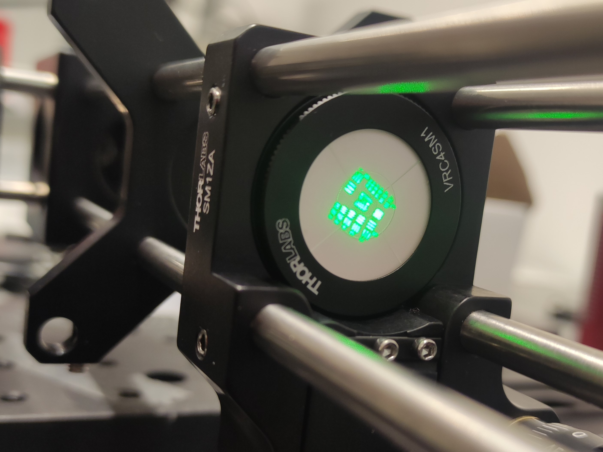

$$\\[10mm]$$


# Introduction


Lorem ipsum dolor sit amet, consectetur adipiscing elit. Sed interdum justo in vehicula varius. Lorem ipsum dolor sit amet, consectetur adipiscing elit. Maecenas a augue condimentum, placerat dui ut, consequat enim. Integer eu bibendum ligula, vitae porttitor turpis. Nam eu volutpat elit. Vivamus efficitur semper vulputate. Nam ornare diam turpis.

$$\\[5mm]$$


# Educational materials

Space for educational materials about the physics (with option to download the PDFs or similar).

$$\\[5mm]$$


# Bill of Materials

* Placeholder item 1.
* Placeholder item 2.

$$\\[5mm]$$


# Experimental setup

## Diagram

```{r echo=FALSE, out.width = "30%", fig.align = "left"}


```


## Step by step

1. Step 1.
2. Step 2.
3. ...


