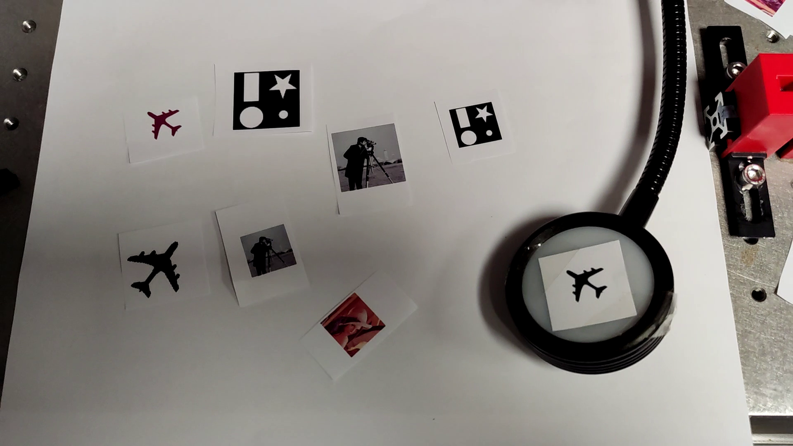
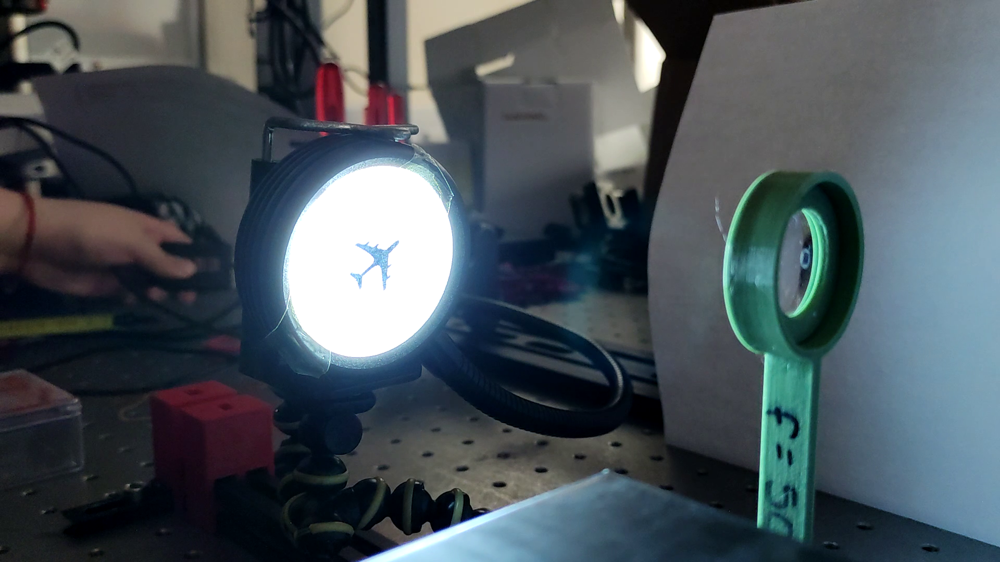
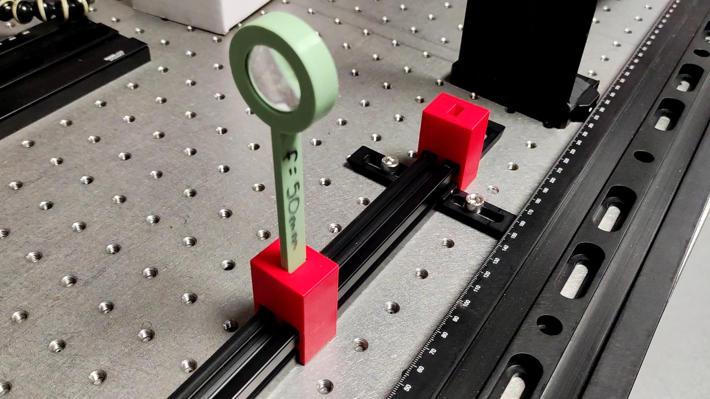
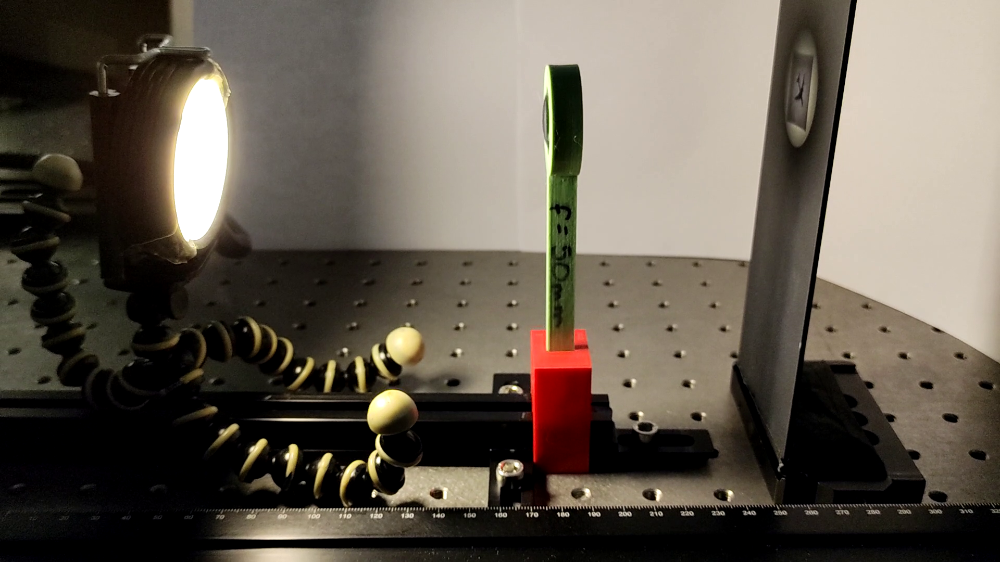

# Introduction


In this  demo, you will observe how convex lenses work and how they are used in everyday objects such as video projectors, cameras, and magnifying glasses. During the demo (and with the accompanying educational materials) you will learn the science behind how convex lenses work: the focal point and how they form real or virtual images depending on the distance to the object to image.


The activity is suitable for teachers, students, or just someone interested in optics.


# Bill of materials

This is a suggested list of materials, but make this demonstration your own by exchanging for the materials you have available in your lab, house, or nearest store.

1. Lamp or other light source (cellphone light for example).
2. Image sample.
3. Convex lens with holder (can be replaced with a magnifying glass).
4. Screen to view the projected image.

For the guide these are the materials used:

#### Light source + image sample {-}

Printed samples with regular printed and fixed to a common desk lamp with tape.

<figure>
  
  <figcaption>Image samples.</figcaption>
</figure>

<figure>
  
  <figcaption>Light source.</figcaption>
</figure>

#### Convex lens and 3D printed mount  {-}

Some mounts were printed to fix loose lenses. For the experience a `f = 50 mm` lens was used.

<figure>
  
  <figcaption>Lenses in custom mounts.</figcaption>
</figure>


#### Holders and rail  {-}

Similarly, holders were printed that can be used on a common aluminium profile.

<figure>
  
  <figcaption>Holders in aluminium profile.</figcaption>
</figure>


#### Screen  {-}

A solid black screen was placed for projecting the real images in the experiments.

<figure>
  
  <figcaption>Holders in aluminium profile.</figcaption>
</figure>

> **Note:** the files for recreating the 3D printed pieces of the lens holders and the lens mounts will be made available in the future in this same site.


# Experimental setup

## Diagram {-}

Place the elements and align them before continuing to the step by step describing the different positions for image generation.

<figure>
  
  <figcaption>Experimental setup.</figcaption>
</figure>

In each step remember to move the position of the sample and then find the focused image by moving the screen closer or further away from the lens.

## Step by step {-}

For helping the procedure and visualization refer to the educational materials under the "Converging vs. diverging lenses, real and virtual images" tab. 

---

| **Object position** | **Image type** | **Orientation** | **Size** |
|----------------------|----------------|-----------------|----------|
| Beyond 2F (`u > 2f`) | Real           | Inverted        | Smaller  |

```markdown
Applications: focusing a distant image on the film or image sensor of a camera.
```

<figure>
   2f`)." style="width: 100%; height: auto;">
  <figcaption>Beyond 2F (`u > 2f`).</figcaption>
</figure>


---

| **Object position** | **Image type** | **Orientation** | **Size** |
|----------------------|----------------|-----------------|----------|
| At 2F (`u = 2f`)     | Real           | Inverted        | Same     |

```markdown
Applications: experiments where you want ot observ the actual size of the sample.
```

<figure>
  
  <figcaption>At 2F (`u = 2f`).</figcaption>
</figure>


---

| **Object position** | **Image type** | **Orientation** | **Size** |
|----------------------|----------------|-----------------|----------|
| Between F and 2F     | Real           | Inverted        | Larger   |

```markdown
Applications: the size of the projected image can be increased such as the case of projectors.
```

<figure>
  
  <figcaption>Between F and 2F.</figcaption>
</figure>


---

| **Object position** | **Image type** | **Orientation** | **Size** |
|----------------------|----------------|-----------------|----------|
| At F (`u = f`)       | No image       | –               | –        |

<figure>
  
  <figcaption>At F (`u = f`).</figcaption>
</figure>

---

| **Object position** | **Image type** | **Orientation** | **Size** |
|----------------------|----------------|-----------------|----------|
| Inside F (`u < f`)   | **Virtual**    | Upright         | Larger   |


```markdown
Applications: magnifying glass.
```

<figure>
  
  <figcaption>Inside F (`u < f`).</figcaption>
</figure>


> ### Licenses
>
> **Instructions, documentation:** Creative Commons Attribution Share Alike 4.0
>
> (Planned) **Hardware (3D printing models):** CERN Open Hardware Licence Version 2 - Strongly Reciprocal
>
> (Planned) **Software:** GNU GPL V3.0