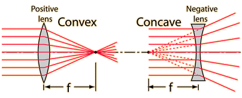
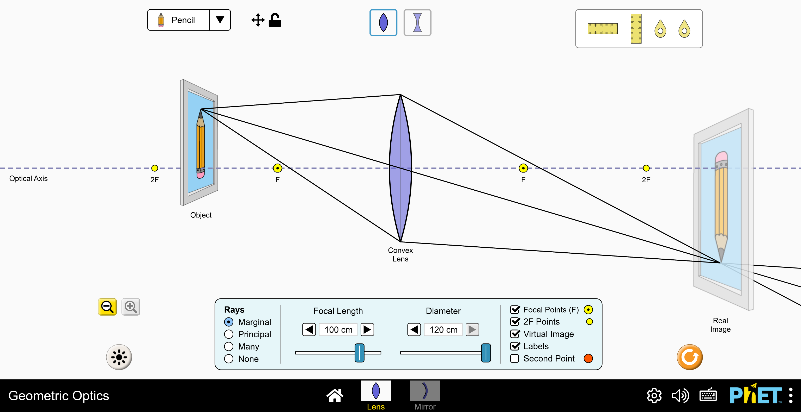
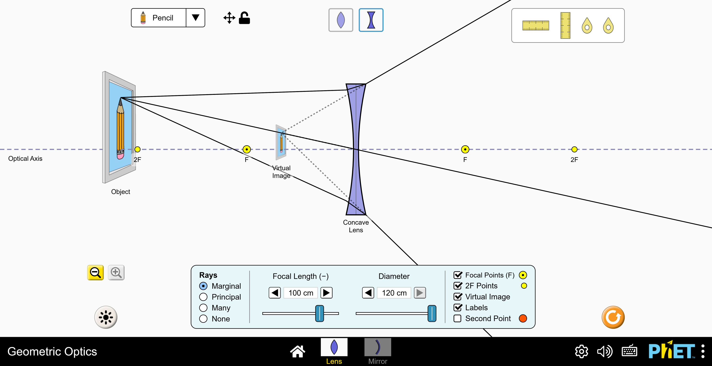
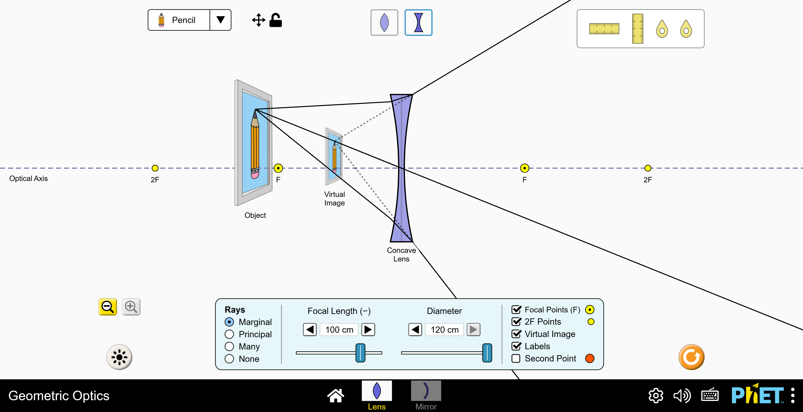
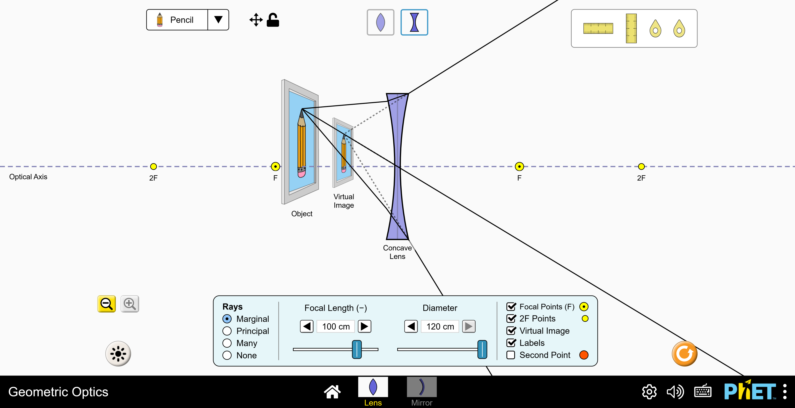

# Types of lenses

Two types of (thin) lenses will be studied during this demonstration. They are defined by their shape and a property known as their focal length `f` that can be positive or negative. It depends on the material (index of refraction of the glass) and the radii of curvature of the front and back surfaces of the lens.

<figure>
  
  <figcaption>Principal focal length. Reference: C. Nave, Hyperphysics,  <http://hyperphysics.phy-astr.gsu.edu/hbase/geoopt/foclen.html>.</figcaption>
</figure>

## Converging lens (convex) {-}
This is the "magnifying glass" type.

| **Property** | **Description** |
|-----------------|---------------------------------------------|
| **Shape** | Thick in the middle, thin at edges. |
| **Behavior** | Brings parallel light rays together to a focal point. |
| **Focal length** | Positive (`f > 0`). |

## Diverging lens (concave) {-}

| **Property** | **Description** |
|-----------------|---------------------------------------------|
| **Shape** | Thin in the middle, thick at edges. |
| **Behavior** | Spreads parallel light rays apart (appears to come from virtual focus). |
| **Focal length** | Negative (`f < 0`). |

Lenses are commonly used for imaging, obtaining “real images” or “virtual images” depending on the conditions. 

> **Real Images**  
>
> * Can catch them on a screen (like from the projector in the cinema).  
>
> * Always inverted (upside down). 
>
> * Formed when the light is focused and comes “together”.  
>  
> **Virtual Images**  
>
> * Can't project them on a screen.  
>
> * They are not inverted (they keep the initial orientation). 
>
> * The light seems to come from an apparent position where the object is not actually located.  

Some of the characteristics are summarized in the following table.

| **Property** | **Real image** | **Virtual image** |
|---------------|--------------------------|----------------------------|
| **Formation** | Light rays actually meet | Light rays *appear* to meet |
| **Screen** | Can be projected | Cannot be projected |
| **Orientation** | Always inverted | Always upright |
| **Example** | Camera image, projector in the classroom or at the movies | Magnifying glass image |

---

# Image formation rules

> Geometric Optics simulations by PhET Interactive Simulations, University of Colorado Boulder, licensed under CC-BY-4.0 (https://phet.colorado.edu/en/simulations/geometric-optics).

## Converging lens (convex) {-}

The image formation depends on the object position with respect to the focal length of the lens (F in the diagrams).

**Applications:** cameras, telescopes, magnifiers (when close).

| **Object position** | **Image type** | **Orientation** | **Size** |
|----------------------|----------------|-----------------|----------|
| Beyond 2F (`u > 2f`) | Real           | Inverted        | Smaller  |
| At 2F (`u = 2f`)     | Real           | Inverted        | Same     |
| Between F and 2F     | Real           | Inverted        | Larger   |
| At F (`u = f`)       | No image       | –               | –        |
| Inside F (`u < f`)   | **Virtual**    | Upright         | Larger   |

---

<figure>
   2f`)." style="width: 100%; height: auto;">
  <figcaption>Beyond 2F (`u > 2f`). Made with PhET Interactive Simulations.</figcaption>
</figure>

---

<figure>
  
  <figcaption>At 2F (`u = 2f`). Made with PhET Interactive Simulations.</figcaption>
</figure>

---

<figure>
  
  <figcaption>Between F and 2F. Made with PhET Interactive Simulations.</figcaption>
</figure>

---

<figure>
  
  <figcaption>At F (`u = f`). Made with PhET Interactive Simulations.</figcaption>
</figure>

---

<figure>
  
  <figcaption>Inside F (`u < f`). Made with PhET Interactive Simulations.</figcaption>
</figure>

---

## Diverging lens (concave) {-}

Always produces a virtual, upright, smaller image (regardless of object position).

**Applications:** corrective glasses for nearsightedness (myopia), eyepieces in optical devices like microscopes or telescopes, peepholes.

---

<figure>
  
  <figcaption>Diverging lens beyond 2F. Made with PhET Interactive Simulations.</figcaption>
</figure>

---

<figure>
  
  <figcaption>Diverging lens between F and 2F. Made with PhET Interactive Simulations.</figcaption>
</figure>

---

<figure>
  
  <figcaption>Diverging lens inside F. Made with PhET Interactive Simulations.</figcaption>
</figure>

---

# Quick summary!

Converging lens:

* Real image when object is outside focal point (`u > f`).

* Virtual image when object is inside focal point (`u < f`).

Diverging lens:

* Only virtual images possible.

> ### Licenses
>
> **Instructions, documentation:** Creative Commons Attribution Share Alike 4.0
>
> (Planned) **Hardware (3D printing models):** CERN Open Hardware Licence Version 2 - Strongly Reciprocal
>
> (Planned) **Software:** GNU GPL V3.0
